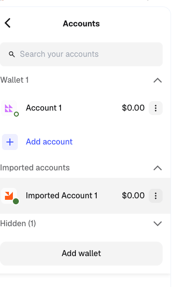

# Blockchain-Based Supply Chain Provenance System Project Read Me

The aim of this project is to create a blockchain based system that utilizes smart contracts to track public spending on public procurement from the start of the contract until the final payment is completed.  Government transparency is fundamental to an informed democracy. The relationship between the government and those who supply it with goods and services is often murky and vulnerable to corruption. The application will be accessed through a frontend using React.js. All information for the smart contracts and transactions will be stored on the blockchain and can be accessed by all stakeholders. Government entities will register businesses in the system, by coordinating with them to register an associated wallet address for their business.  These will be tied to existing off-chain business identification methods using a relational database that our frontend can access.


## Architecture

The chosen platform will be Ethereum blockchain with a tech stack of Hardhat, MetaMask, Ether.js, and React.js. Three main stakeholders exist in this project, the government, businesses and the public. Contracts will be organized in a Smart contract Factory. Contracts can be created by the government and read by the public. Contractors/Vendors can register wallets to a database and be assigned contracts via the government.


## Dependencies
 
| Package | Version |
|---------|---------|
| Node.js | v18+ |
| React | 19 |
| Ethers | v6 |
| Dotenv | latest |
| Hardhat | 2.x |

## Initial Setup for Development

* Create Directory 

    ```bash
    mkdir hardhat005
    ```

* Create React Project in new Directory

    ```bash
    npx create-react-app
    ```

* Initialize HardHat (select older version, say yes to all other prompts)

    ```bash
    npc hardhat —init
    ```

* Edit Contracts and ignition as desired

    Example: https://www.youtube.com/watch?v=QbNyn184smQ

* Setup hardhat.js for locathost

    ```javascript
    require("@nomicfoundation/hardhat-toolbox");

    /** @type import('hardhat/config').HardhatUserConfig */
    module.exports = {
    solidity: "0.8.28",
    networks: {
        hardhat: {
        chainId: 1337,
        },
    },
    };
    ```

* Compile and run hardhat

    ```bash
    npx hardhat compile
    npx hardhat node
    ```

* Setup MetaMax to use custom network matching your local config

    

* Deploy to Local network
    ```bash
    npx hardhat  ignition deploy ./ignition/*** --network localhost --reset
    ```

* Import Wallet and setup fake ether developer account 

    

* Start React
    ```bash
    npm run start
    ```
## Authors

- [@griseldacarl](https://www.github.com/griseldacarl)
- [@craig653](https://www.github.com/craig653)

