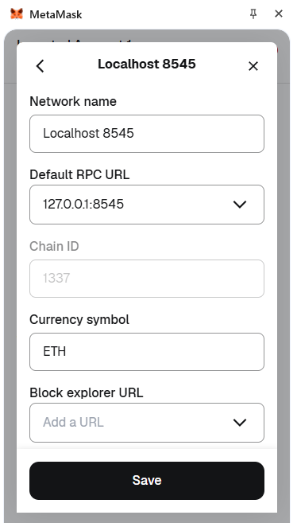

# Blockchain-Based Supply Chain Provenance System Project Read Me

The aim of this project is to create a blockchain based system that utilizes smart contracts to track public spending on public procurement from the start of the contract until the final payment is completed.  Government transparency is fundamental to an informed democracy. The relationship between the government and those who supply it with goods and services is often murky and vulnerable to corruption. The application will be accessed through a frontend using React.js. All information for the smart contracts and transactions will be stored on the blockchain and can be accessed by all stakeholders. Government entities will register businesses in the system, by coordinating with them to register an associated wallet address for their business.  These will be tied to existing off-chain business identification methods using a relational database that our frontend can access.


## Architecture

The chosen platform will be Ethereum blockchain with a tech stack of Hardhat, MetaMask, Ether.js, and React.js. Three main stakeholders exist in this project, the government, businesses and the public. Contracts will be organized in a Smart contract Factory. Contracts can be created by the government and read by the public. Contractors/Vendors can register wallets to a database and be assigned contracts via the government.


## Dependencies

| Package     | Version             |
|------------|-------------------|
| Node.js    | v18+               |
| React      | 19.x               |
| Ethers     | v6.x               |
| Dotenv     | latest             |
| Hardhat    | 2.x                |
| Express    | 4.x (backend)      |
| MySQL2     | 3.x (backend)      |
| Nodemon    | 3.x (backend dev)  |
| Concurrently | 9.x (root dev)   |

## Run directions & Scripts

From the **root folder**, you can run:

```bash
#Setup ENV File
cp src/backend/env_template src/backend/.env

# Install all dependencies for frontend and backend
npm run install-all

# Start both backend and frontend concurrently
npm run start-all

# Start HardHat
npm run start-hardhat

# Compile Contracts
npm run compile

# Deploy smart contracts to local blockchain
npm run deploy

# Full dev workflow (install + start)
npm run dev

# Quick dev (start without reinstalling dependencies)
npm run quick-dev

# Start backend only
cd src/backend
npm run dev

# Start frontend only
cd src/frontend
npm start
```

## Wallet Setup

### 1. Install MetaMask

Download and install the MetaMask browser extension:
[https://metamask.io/download](https://metamask.io/download)


### 2. Add Custom Network

Navigate to **Settings → Security & Privacy → Add Custom Network** and enter the Hardhat local network details.




### 3. Import a Test Wallet

Start the Hardhat local node (`npx hardhat node`), it prints a list of pre-funded test accounts. Import one of these into MetaMask using its private key.

**Example:**
```
Account #0: 0xf39Fd6e51aad88F6F4ce6aB8827279cffFb92266 (10000 ETH)
Private Key: 0xac0974bec39a17e36ba4a6b4d238ff944bacb478cbed5efcae784d7bf4f2ff80
```

## Authors

- [@griseldacarl](https://www.github.com/griseldacarl)
- [@craig653](https://www.github.com/craig653)
- [@mpeter56](https://www.github.com/mpeter56)
- [@addisonmcs](https://www.github.com/addisonmcs)

